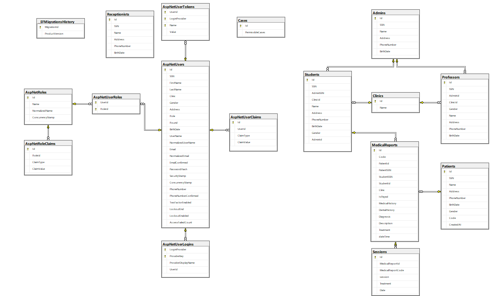

# Gradution Project 
##  Dental University Hospital System (DUHS)
The Dental University Hospital System (DUHS) is a software solution designed to streamline 
and improve the operations of a dental hospital of south valley university. The system aims to replace the existing paper based system, which is disorganized and inefficient. The DUHS provides functionality for 
patients, doctors, Professor, administrators and receptionist to enhance their experience and 
optimize workflow.
 

## Content 
  * [System Users](#system-users)
  * [System Features](#system-features)
  * [Abstract](#abstract)
  * [Database Tables](#database-tables)
  * [Technologies](#technologies)
  * [Database Schema](#database-schema)
  * [Configuraion](#configuration)
  * [Installation](#installation)

## System Users
  * Admin
  * Professor
  * Student
  * Patient
  * Receptionist

## System Features
  * Patient System
    * Patient Register
      * The patient register in the system by filling his 
  personal data before reservation in the first time, the 
  data is saved in database.
    * Patient Reserve
      * The DUHS allow the patient reserve by his national 
   id to receive a specific code and appointment from 
   the system.
    * Patient code
      * The DUHS shall allow patient receives a specific 
   code never repeated after reservation and the doctor 
   use this code to find patient's data
    * Reserve appointment
      * The DUHS shall allow patient take appointment 
    based on his turn in submit.
    * Patient print
      * The DUHS allows the patient to print his specific 
    code and the appointment
 * Admin System
   * Admin login
     * When admin is admitted in login. The data is 
  checked if admin already registered with the system 
  if his/her ID is entered into the computer.
    * Enter number of patients
      * The DUHS shall allow admin can enter the number 
   of patients that can reserve in a day
   * Add doctor
     * The DUHS shall allow admin to add doctor to 
   clinic in the system.
   * Add prof
     * The DUHS shall allow admin to add prof to his 
   specific clinic in the system.
   * Add receptionist
     * The DUHS shall allow admin to add receptionist in 
   the system.
   * Assign ID
     * The DUHS shall allow admin to give (doctor / prof 
   / receptionist) ID. This ID shall be used by them 
   throughout their stay in university hospital.
  * Doctor System
    * Doctor login
      * When doctor is admitted in login. The data is 
   checked if doctor already registered with the system 
   if his/her ID is entered into the computer.
    * Patient description
      * When the patient comes in his appointment, the 
  doctor enters his code to look at the patient' 
  description.
    * Write examination
      * The DUHS shall allow the doctor to write the 
   examination of patient.
    * Continue examination
      * The DUHS shall allow another doctor to continue 
   the examination after sending the patient to another 
   clinic.
    * Prescribe treatment
      * The DUHS shall allow doctor to prescribe the 
   treatment after the final examination.
  * Professor System
    * Prof login
      * When prof is admitted in login. The data is checked 
  if prof already registered with the system if his/her 
  ID is entered into the computer.
    * View the record
      * The DUHS shall allow staff to view doctors’ record 
  to look at their work.
   * Receptionist System
     * Receptionist login
       * When receptionist is admitted in login. The data is 
  checked if receptionist already registered with the 
  system if his/her ID is entered into the computer.
     * Confirm the reservation
       * The DUHS shall allow receptionist to confirm 
  patient’s reservation and view them.


## Abstract 
  * Patient
      * the system allows them to reserve appointments by filling in their data and 
    receiving a unique code. Patients can also print their appointment details for reference. This 
    eliminates the need for patients to wait in long queues and provides a more organized and 
    efficient appointment system
  * Administrators
      * Administrators have access to the system to manage appointments and control the overall 
    functioning of the hospital. They can add and delete doctors from the system, assign unique IDs 
    to doctors, and oversee the operations of the clinic. This gives administrators greater control and 
    enables them to optimize resource allocation
  * Doctors
      * Doctors can log into the system using their credentials and access patient information by entering 
    their unique codes. They can write examination reports, prescribe treatments, and even send 
    patients to other clinics or reschedule appointments if necessary. The system helps doctors 
    manage patient data and facilitates a smoother workflow.
  * Professors
      * Prof Members have access to the system to view doctors' records and monitor their work. This 
    allows for better coordination and ensures that doctors are adhering to the hospital's protocols 
    and standards.
  * Receptionists
      * Confirm the reservation of patient and The DUHS shall allow receptionist to confirm 
patient’s reservation and view them.

## Database Tables 
  * Admin
  * Professor
  * Student
  * Patient
  * MedicalReport
  * Receptionist
  * Session
  * Cases
  * Clinic
  * Identity Tables

## Technologies 
  * Asp.net core 6 web api
  * Entity Framework Core
  * Linq
  * Sql Server
  * DTOs
  * Repository Pattern
  * Dependency injection
  * AspNetCore.Identity: for authentication and authorization.
  * JWT: as token-based authentication.

## Database Schema
 

## Configuration 
``` c#
{
  "Logging": {
    "LogLevel": {
      "Default": "Information",
      "Microsoft.AspNetCore": "Warning"
    }
  },
  "AllowedHosts": "*",
  "ConnectionStrings": {
    "DefaultConnectionString": "Data Source=DentalHospital.mssql.somee.com;Database=DentalHospital;User id=mohamednasr9_SQLLogin_1;pwd=fjl3lsiuhw;Connect Timeout=30;Encrypt=False;"
  },
  "JWT": {
    "Issuer": "http://localhost:5109",
    "Audience": "http://localhost:4200",
    "Key": "StrOnGKeYSecRETKeY"
  }
}
```

## Installation
  1. Clone Repo
     ```bash
     git clone https://github.com/mohamedNasr99/gradution-project-dental-hospital-.git
     ```
  2. Restore Packages
      ```bash
      git restore
      ```
     

